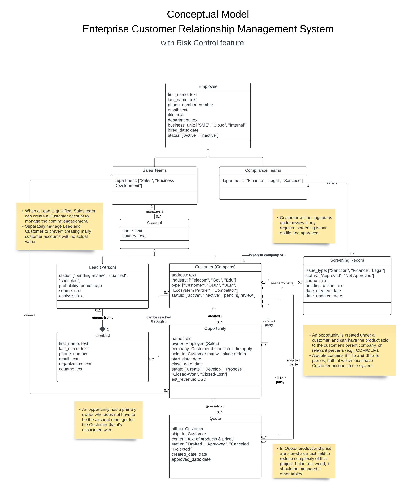
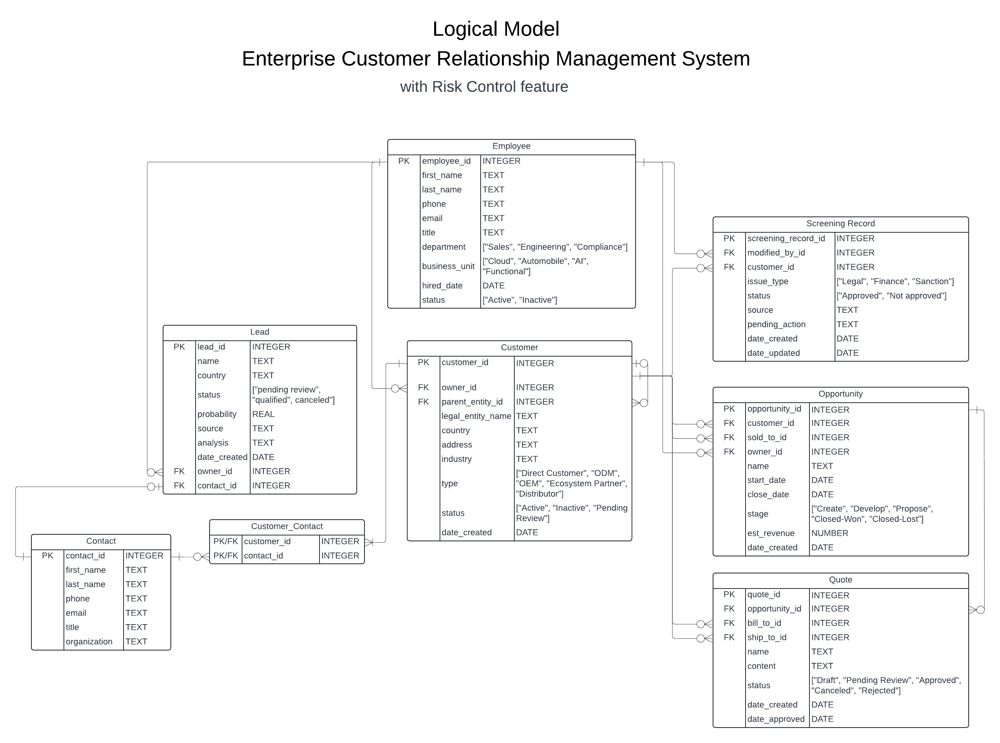

# Enhanced Customer Relationship Management System

This project creates a Customer Relationship Management (CRM) system for managing enterprise customers. In addtion, it incorporates risk control mechanism to ensure all parties of a transaction are screened for potential risks.

<!-- The system is built using Node.js and Express.js, and uses [database name] as the database. -->

## Conceptual Model

UML Class Diagram


## Logical Model

Entity Relation Diagram


## Schema

Refers to the database schema in the [schema.pdf](docs/schema.pdf) file.

<!-- ## How to run it

- Requires installation of node, express, [database name]

```
npm install
npm start
```

## How to use it

Go to http://localhost:3000 and [do something] -->

## Database

This project uses SQLite as the database. To use the database, clone this repository, navigate to the queries directory, and run the following commands in the terminal:

1. Initialize a new database with the schema:

   ```bash
   sqlite3 database.db < schema.sql
   ```

2. Populate the database:

   ```bash
   sqlite3 database.db < data.sql
   ```

3. To run queries on the database, use the following command. Change the number in the query file name to run different queries:

   ```bash
   sqlite3 database.db < query1.sql
   ```

4. To confirm that the tables were created and conform to the constraints, refer to the [ddl_outputs.pdf](docs/ddl_outputs.pdf) file.

5. To view example outputs of the queries, refer to the [dml_outputs.pdf](docs/dml_outputs.pdf) file.

---

_This project was developed as part of the course CS 5200 Database Management Systems taught by Professor John Alexis Guerra Gomez at Northeastern University (Oakland)._
